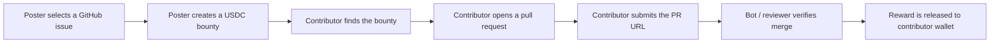

# Collaborators

Collaborators is a GitHub bounty marketplace for open-source work. Project owners attach USDC rewards to public GitHub issues, contributors submit pull requests, and rewards are released when the linked PR is merged and verified.

The app combines GitHub issue discovery, Privy authentication, Solana wallet support, and bounty/submission tracking in a Next.js dashboard.

## What you can do

### For contributors

- Browse open GitHub issues with active USDC rewards.
- Connect with GitHub through Privy authentication.
- Link a Solana wallet for reward payouts.
- Submit a pull request URL as proof of work.
- Track pending, verified, and solved bounty submissions.

### For bounty posters

- Add funded rewards to public GitHub issues.
- Monitor submitted PRs from contributors.
- Use GitHub bot installation status to support verification flows.
- Keep bounty status and solver history in one dashboard.

## How it works



1. **Authenticate** — users sign in with GitHub through Privy.
2. **Discover or create bounties** — the dashboard lists bounty-backed GitHub issues and user-owned issues.
3. **Build the fix** — contributors work directly in GitHub using the normal fork/branch/PR workflow.
4. **Submit proof** — contributors paste the merged or review-ready PR URL into Collaborators.
5. **Verify and pay** — the platform tracks PR status and releases the bounty when the solution is accepted.

## Tech stack

| Area | Technology |
| --- | --- |
| Framework | Next.js 15, React 19, TypeScript |
| Auth | Privy with GitHub login |
| Wallets | Privy embedded Solana wallets + external wallet support |
| Database | Prisma + PostgreSQL |
| GitHub integration | Octokit / GitHub APIs |
| Styling | Tailwind CSS |
| Deployment | Vercel-ready |

## Repository structure

```text
.
├── prisma/                 # Prisma schema and database models
├── public/                 # Static assets and app icons
├── src/app/                # Next.js app routes and API handlers
├── src/components/         # Reusable UI and dashboard components
├── src/hooks/              # Privy/auth helper hooks
├── src/services/           # GitHub and app service helpers
├── src/utils/              # Shared constants and utility functions
└── package.json            # Scripts and dependencies
```

## Prerequisites

- Node.js 18+
- pnpm
- PostgreSQL database
- Privy app ID / credentials
- GitHub OAuth app credentials
- Solana wallet configuration for payouts

## Environment variables

Create `.env.local` from your local secret store or deployment environment.

| Variable | Required | Purpose |
| --- | --- | --- |
| `NEXT_PUBLIC_PRIVY_APP_ID` | Yes | Privy client app ID used by the frontend provider. |
| `PRIVY_APP_SECRET` | Yes | Server-side Privy verification secret, if used by API routes. |
| `DATABASE_URL` | Yes | PostgreSQL connection string for Prisma. |
| `GITHUB_ID` | Yes | GitHub OAuth app client ID. |
| `GITHUB_SECRET` | Yes | GitHub OAuth app client secret. |
| `NEXTAUTH_SECRET` | If using NextAuth routes | Secret for auth session signing. |
| `NEXTAUTH_URL` | If using NextAuth routes | Local or deployed application URL. |
| `REACT_APP_MINT_AUTHORITY_SECRET_KEY` | If minting/reward flows require it | Solana mint authority key for token operations. |

> Never commit `.env.local`, private keys, OAuth secrets, or wallet seed material.

## Local development

1. Clone the repository:

```bash
git clone https://github.com/andr-drgm/collaborators.git
cd collaborators
```

2. Install dependencies:

```bash
pnpm install
```

3. Configure environment variables:

```bash
touch .env.local
# then fill in the required values from the table above
```

4. Generate Prisma client:

```bash
pnpm prisma generate
```

5. Run database migrations or sync your schema, depending on your environment:

```bash
pnpm prisma migrate dev
# or: pnpm prisma db push
```

6. Start the development server:

```bash
pnpm dev
```

7. Open [http://localhost:3000](http://localhost:3000).

## Useful scripts

| Command | Description |
| --- | --- |
| `pnpm dev` | Start the local Next.js development server. |
| `pnpm build` | Generate Prisma client and create a production build. |
| `pnpm start` | Start the production server after building. |
| `pnpm lint` | Run the configured lint command. |
| `pnpm postinstall` | Generate Prisma client after install. |
| `pnpm prepare` | Install Husky git hooks. |

## GitHub OAuth setup

1. Open GitHub Developer Settings.
2. Create a new OAuth App.
3. For local development, set the callback URL to:

```text
http://localhost:3000/api/auth/callback/github
```

4. For production, set the callback URL to your deployed domain.
5. Copy the client ID and client secret into your environment variables.

## Privy setup

1. Create a Privy app.
2. Enable GitHub as a login method.
3. Configure Solana embedded wallets if you want wallet creation on login.
4. Add your local and production domains to the allowed app URLs.
5. Set `NEXT_PUBLIC_PRIVY_APP_ID` and any server-side Privy secrets in your environment.

## Solana configuration

The app is configured for Solana wallet support through Privy. Review `src/app/PrivyProviders.tsx` before changing network behavior.

Current provider defaults include:

- Solana Mainnet
- Solana Devnet
- Devnet as the default chain for development flows

Use devnet while testing wallet and payout flows. Switch to mainnet only after confirming reward funding, verification, and payout behavior end to end.

## Contributor workflow

1. Pick an active bounty from the dashboard.
2. Open the linked GitHub issue.
3. Fork the target repository and create a focused branch.
4. Implement the fix with tests or documentation updates where appropriate.
5. Open a pull request that references the issue.
6. Submit the PR URL in Collaborators.
7. Track the submission status from the dashboard.

## Bounty poster workflow

1. Sign in with GitHub.
2. Choose one of your public GitHub issues.
3. Create a bounty with the reward amount and description.
4. Install or verify the GitHub bot where required.
5. Review submitted pull requests.
6. Accept the solution and complete reward release once the PR is merged.

## Deployment checklist

Before deploying to production:

- [ ] Production database is provisioned and migrated.
- [ ] Privy production app URL is configured.
- [ ] GitHub OAuth production callback URL is configured.
- [ ] Solana network and wallet settings are reviewed.
- [ ] Secret variables are set in the hosting provider.
- [ ] `pnpm build` passes.
- [ ] Bounty creation, PR submission, verification, and payout flows are tested on devnet or a staging environment.

## Troubleshooting

### GitHub login fails

- Check `GITHUB_ID` and `GITHUB_SECRET`.
- Confirm the callback URL exactly matches the app URL.
- Verify the GitHub OAuth app is not restricted to the wrong domain.

### Wallet is not created or connected

- Confirm the Privy app ID is correct.
- Check that Solana embedded wallets are enabled in Privy.
- Reload the session after changing Privy settings.

### Prisma client errors

- Run `pnpm prisma generate`.
- Confirm `DATABASE_URL` is set.
- Apply migrations or run `pnpm prisma db push` for local development.

### Build fails after dependency changes

- Delete `node_modules` and reinstall with `pnpm install`.
- Confirm your Node.js version is 18 or newer.
- Re-run `pnpm prisma generate` before building.

## Security notes

- Do not commit OAuth secrets, wallet private keys, or database credentials.
- Use devnet for payout testing until the full reward flow is verified.
- Keep reward-release logic server-side and validate all submitted PR URLs.
- Treat GitHub webhook payloads and client-submitted PR URLs as untrusted input.
- Log verification decisions enough to debug payouts without exposing secrets.

## Roadmap ideas

- Automated PR merge verification through GitHub webhooks.
- Richer bounty filters by language, reward size, and repository.
- Contributor reputation pages.
- Bounty escrow status and payout history.
- Team and organization dashboards.

## License

This project is licensed under the MIT License. See the repository license file for details.
